# BX Manager (BeyBladeX_pwa)

**プレイヤーにもコレクターにも使いやすい、ベイブレード X 管理 PWA**

🔗 公開 URL: https://beybladex-pwa.ryo06040123-df6.workers.dev/

---

## 概要

BX Manager は、ベイブレード X(BEYBLADE X)のパーツ管理・デッキ構築・対戦記録・持久力計測をひとつにまとめたプログレッシブウェブアプリ(PWA)です。

「パーツを集めることを目的としているコレクター」と「実際に対戦で結果を出したいプレイヤー」の両方が使えるアプリを目指し、企画・設計・実装まで一人で開発しました。

## スクリーンショット

<p>
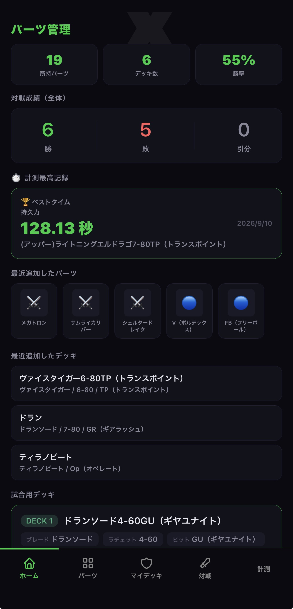
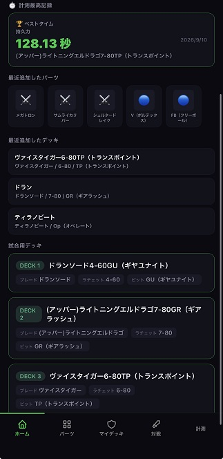
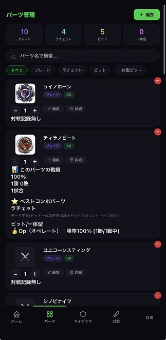
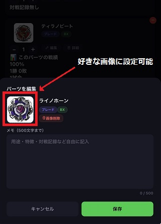
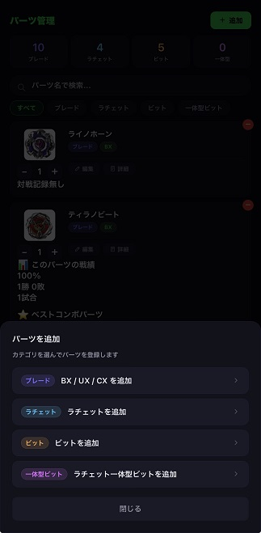
</p>

<p>
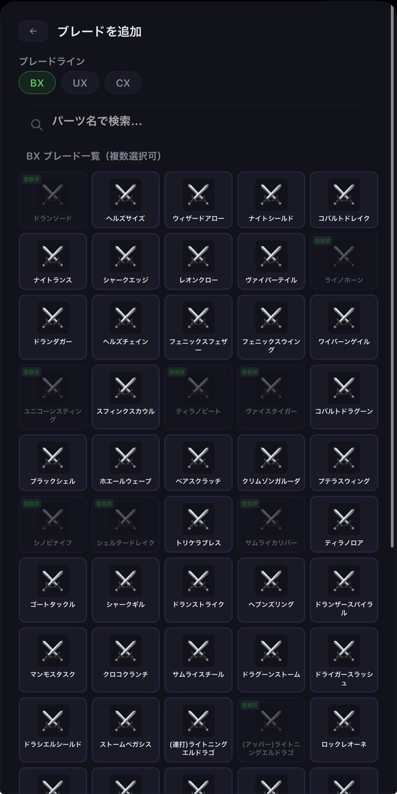
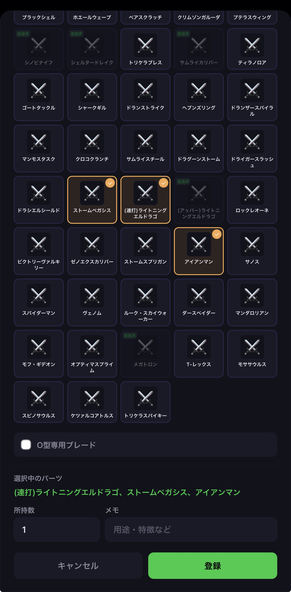
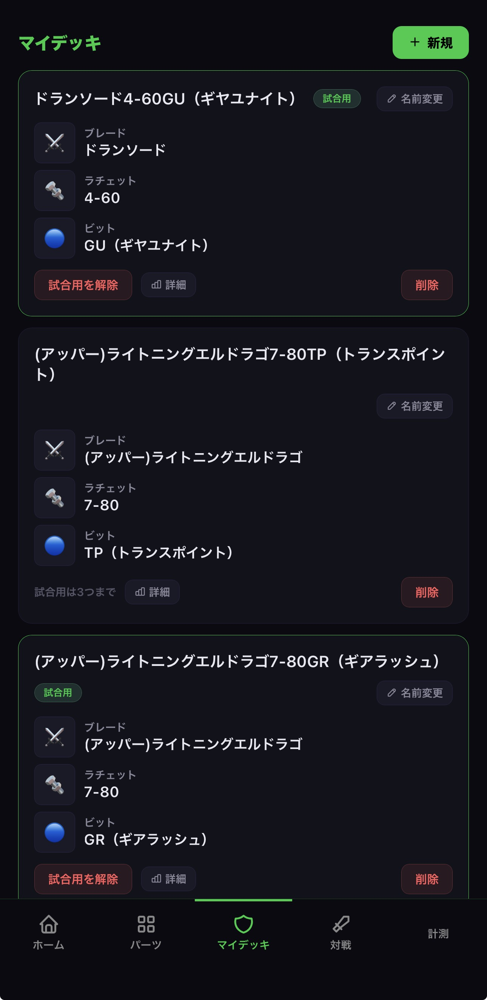
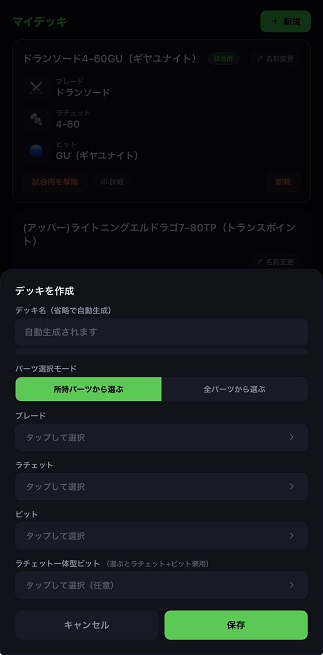
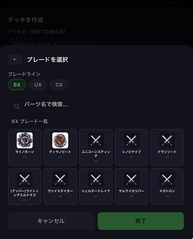
</p>

<p>
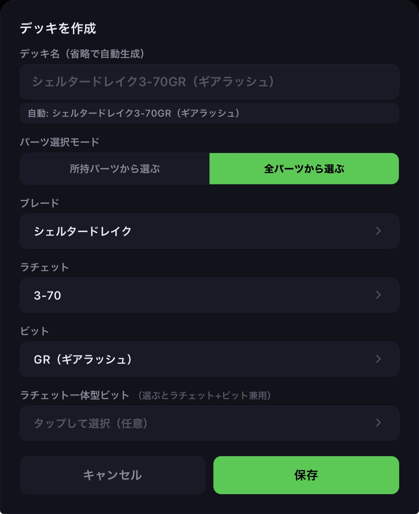
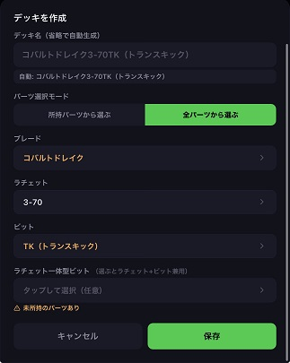
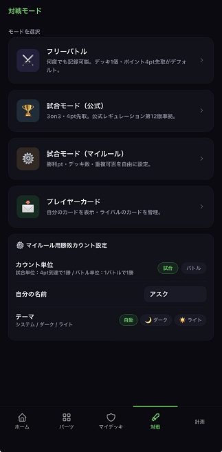
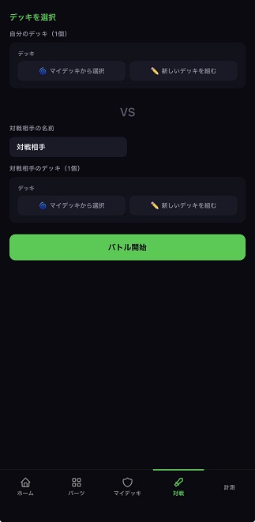
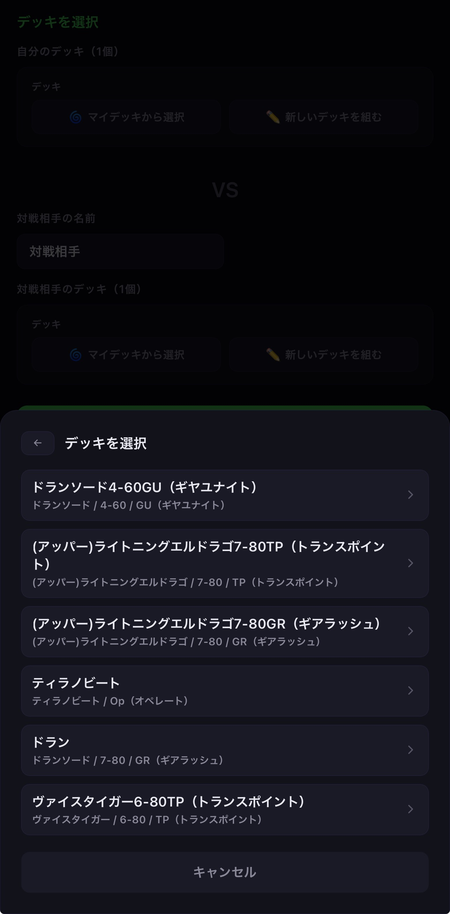
</p>
<p>
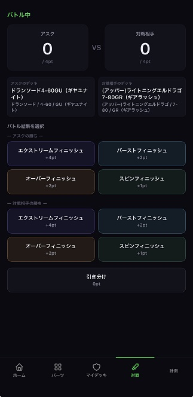
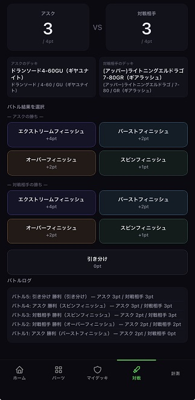
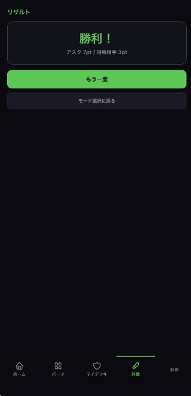
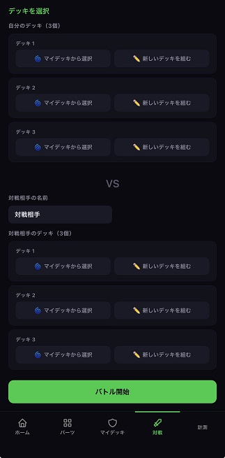
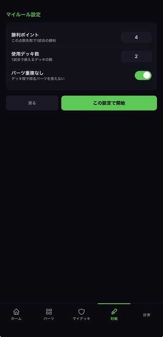
</p>

<p>
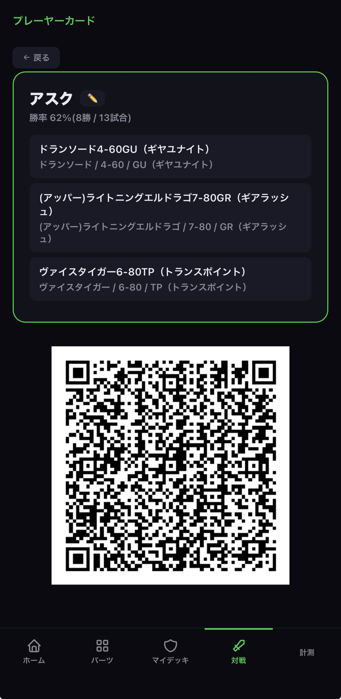
</p>

## 主な機能

### パーツ管理・コレクション機能

- ブレード(BX / UX / CX)、ラチェット、ビット、ラチェット一体型ビットをカテゴリ別に個別管理
- CX 規格の組み合わせパターン(3 パーツ型 / 4 パーツ型)に対応
- パーツ画像・メモ(最大 500 文字)を登録できる、自分だけの図鑑機能

### デッキビルダー

- 「所持パーツから選ぶ」「全パーツから選ぶ」の 2 モードに対応
- デッキ内でのパーツ重複を自動的に防止
- 未所持パーツを使った場合は警告表示
- 「O 型専用ブレードには通常ラチェット使用不可」など、規格上の互換性ルールを自動チェック
- ベストコンボパーツの自動表示(サジェスト機能)

### 対戦記録・分析

- 対戦モード(3 種類)による柔軟な試合記録
- 「試合用デッキ」登録による本番を想定した対戦管理
- 勝率・対戦成績(勝 / 敗 / 引分)を自動集計
- バースト回数の記録・表示

### 計測モード

- スピン時間の計測と、最高記録の保存（持久力測定）
  計測した時間はデッキの詳細画面に記録

### プレイヤーカード機能

- 自分のデッキや実績を 1 枚のカードとして可視化
- QR コードを使用して他人のカードと自身のカードを共有可能、他のユーザーに共有・紹介したくなる機能として設計

## こだわった点

- **プレイヤーとコレクター、両方の使い方を 1 つのアプリで両立**させたこと
- 自分自身がプレイヤーとして「あったら嬉しい」機能を優先的に実装(パーツ重複防止・ベストコンボパーツ表示・バースト回数表示など)、実際の使い勝手を最優先に設計
- 単なるコレクションアプリで終わらせず、**対戦記録に特化した機能**を追加
- プレイヤーカードとしてお互いの情報が載っている「カード」配布、受け取りを可能にすることで友達同士や家族で一緒に遊びながら競い合える機能も実装
- 対戦相手や友達のプレイヤーカードも QR コードを読み取ることでライバルカードとして自身のアプリに登録可能で、ライバルのデッキも閲覧可能。

## 技術スタック

- **フロントエンド**: HTML / CSS / JavaScript(フレームワーク不使用、Vanilla JS)
- **PWA 対応**: `manifest.json` + Service Worker(`sw.js`)によるオフライン対応・ホーム画面へのインストール対応
- **ホスティング**: Cloudflare Pages / Workers

## セットアップ(ローカル環境)

```bash
git clone https://github.com/ASK-XAXIS/BeyBladeX_pwa.git
cd BeyBladeX_pwa

# 任意の静的サーバーで起動(例: http-server)
npx http-server .
```

ブラウザで `http://localhost:8080` などにアクセスして動作を確認できます。

スマートフォンやタブレットでは、ホーム画面に追加することで PWA 化できます。

## ディレクトリ構成

```
BeyBladeX_pwa/
├── index.html        # メイン画面
├── app.js             # アプリケーションロジック
├── style.css          # スタイル
├── sw.js              # Service Worker(オフライン対応)
├── manifest.json      # PWAマニフェスト
├── icon-180.png        # iOS用アイコン
├── icon-192.png        # Android用アイコン
├── icon-512.png        # 高解像度アイコン
├── _headers            # Cloudflare Pages設定
└── _redirects           # Cloudflare Pages設定
```

## 今後の展望

- (完了) QR コードを使ったデッキ共有機能(対戦相手のデッキをスキャンして対戦結果を記録・集計)
- 対戦レーティング分析機能の追加(自分のデッキと相手が使ってきたデッキの勝敗を集計して得意なデッキ、苦手なデッキを可視化する)
- SQLite 等を使用した DB の構築・実装

## 作者

- GitHub: [@RM](https://github.com/ASK-XAXIS)
